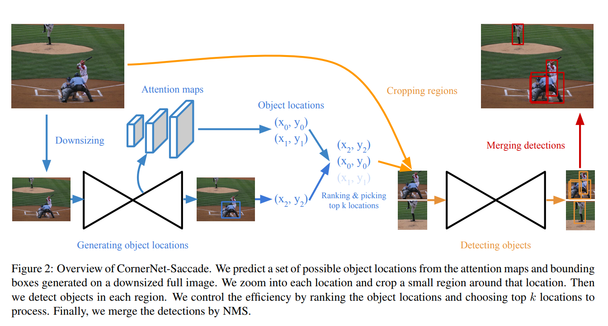
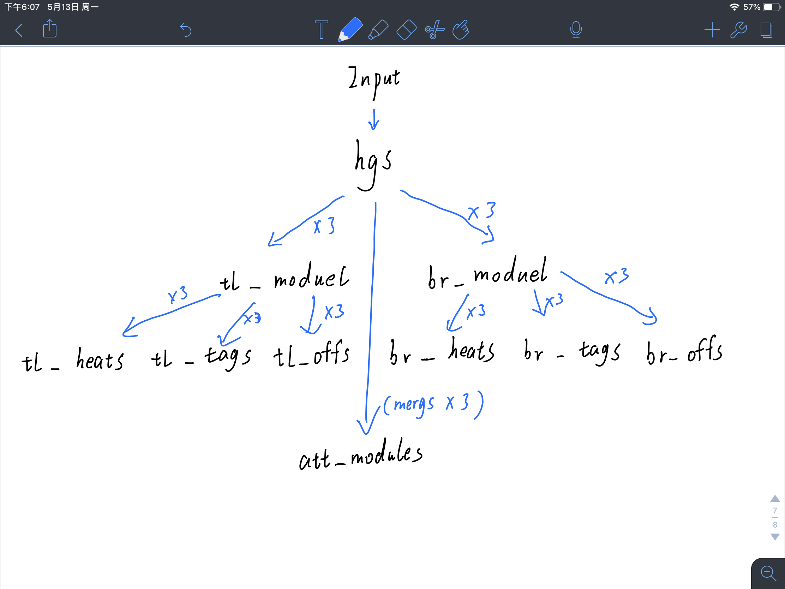
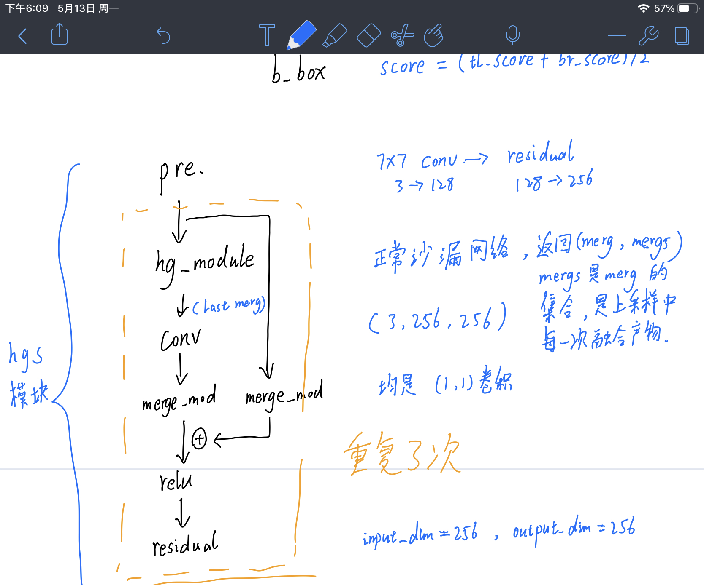
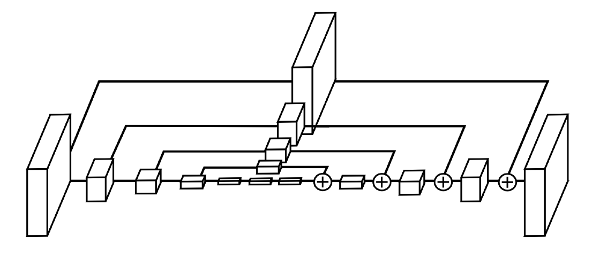
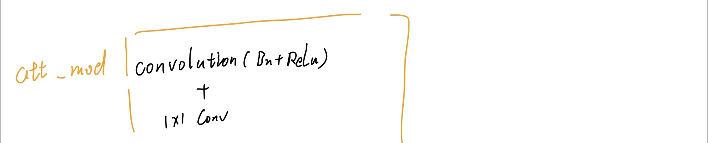
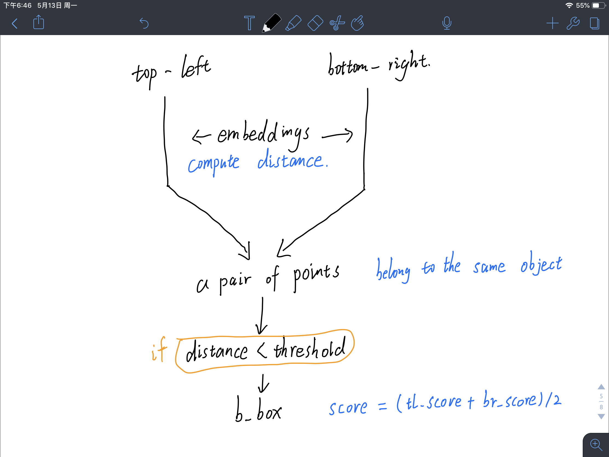
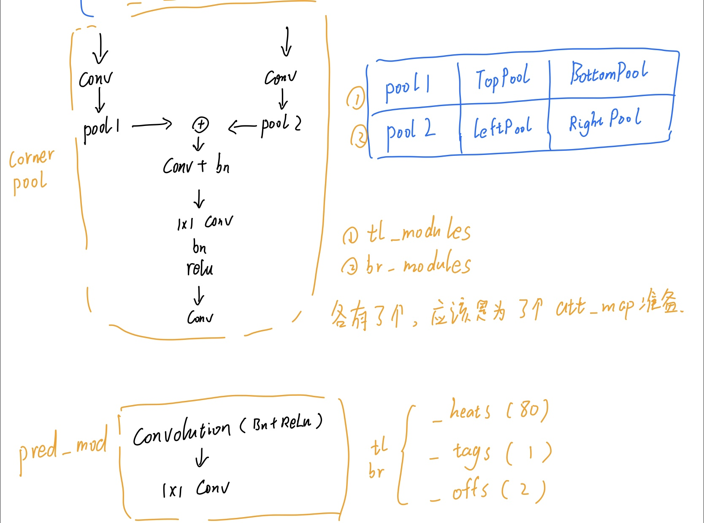

#  CornerNet-Saccade 网络描述

​																								图1

​		作者在论文中描述的整体模块是图1 表示的那样，但是在代码里没有最后的检测部分。下面是对之前不太清楚的地方做重新描述。

​		CornerNet Saccade 中， backbond 是 `hourglass network`，在论文中体现在图1的 Generating object locations 部分。也就是靠沙漏网络里提取特征然后产生 **注意力图** 以及 **Bouding Box**。在代码实现中，CornerNet Saccade 的网络如图2 所示。

​					

​																					   图2

​		在 Input 输入之后，会直接进入一个 hourglass 模块，也就是图2 中的 hgs 部分，这也是论文中描述出来的部分，依靠多个沙漏网络堆叠进行特征提取，最后使用 1x1 Conv. 产生 Attention Maps（按照论文描述会产生三个 Attention Map）。实际操作中会有一些出入，具体见图3。

​				

​																						图3

​																						图4

​		一开始的 `Pre` 操作是提升维度。之后橙色框包含的部分才是真正“堆叠”的部分。其中 `hg_module` 是正常的沙漏设计（图4，但作者没有采用图5中的4层，只有3层），返回值是（merg， mergs）。merg 指沙漏网络在上采样中每次融合后的特征图，CornerNet Saccade少一层，所以只产生3个不同尺寸的 merg。而 mergs 是 merg 的集合，存储着每一次 merg 结果。merge_mod 是1x1 Conv.，用来调整图像通道进行融合。每个 `hg_module` 产生 3 个不同尺寸的 merg，作者调用了 3 次 `hgs` 模块产生了3个 mergs 集合共包含 9个 merg，每个尺寸的 merg 共三个。这也就对应了 Saccade 经过这个网络以后产生 3 个不同尺寸的 Attention Map。每一份 merg 都有一个 预测模块来做预测（一共9个模块），模块如图5 中 `att_mod`。做正常的卷积后使用 1x1 的卷积（论文中说的是 sigmoid）。

​						

​																								图5

​		到此结束了 Attention Map 的预测。然而还有一个 Bouding Box。这里是论文里非常非常简短带过的部分，论文中是采用了 CornerNet 的方法来生成 Bouding Box。

​		在CornerNet中，寻找 Bouding Box 是靠 Corner。作者提出了三元组：Corner， Embedding， Offsets。Corner 分为左上角 Corner 和 右下角 Corner，一对 Corner 可以描述一个 Bouding Box（前提是左上和右下的 Corner 属于同一个对象）， Bouding Box 的 Score 是两个 Corner Score的平均值。Embedding 是描述 Top-Left Corner 与 Bottom-Right Corner 的一组矢量，矢量距离的长短表征了两个 Corner 属于同一个对象的可能性，距离越短越可能是同一个对象。Offsets 用来将 Corner 从热点图映射到原图像。过程如图6。

​                	

​																						图6

​                  

​																						图7

​		所以图2中，还有另外两个分支 `tl_module` 和 `br_module`，他们主要是为了预测 **左上角Corner** 和 **右下角Corner** 做准备（CornerNet 论文中提到这两个池化是用来增强局部外观特征）。之前 `hgs`模块结果输出是 3 个 mergs 集合，也就是每个堆叠模块的输出，均用于做预测。Top-Left 和 Bottom-Right 使用的是一套代码，下面只以 Top-Left 为例。在CornerNet中，作者提到了Top-Left 热点图的产生，是用了两个 Corner Pooling。在代码中网络结构如图7 中的 Corner Pool。同一份输入会分别进行 TopPool 和 Left Pool，产生的结果会融合再卷积调整。

​		再之后的 `tl_heats(80)`、`tl_tags（1）`、`tl_offs（2）` 使用的均是图7 的 pred_mod，直接对 `tl_module` 产生的特征图进行预测得到热点图。他们括号中的80、1、2代表通道数。heat 是 Corner，应该是只含每类得分。 

> 个人猜测， tags 应该就是 CornerNet 论文中提到的 embeddings，off 应该是 offsets。

​		到此网络就结束了，返回了heats、tags、offs、还有 attentions（9个，未融合），也就是代码中网络并未给完。

