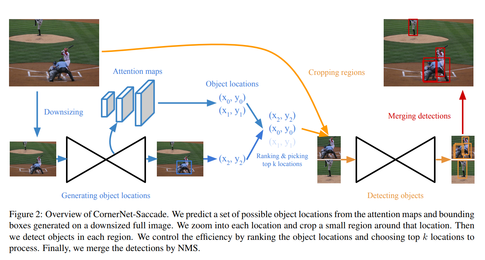
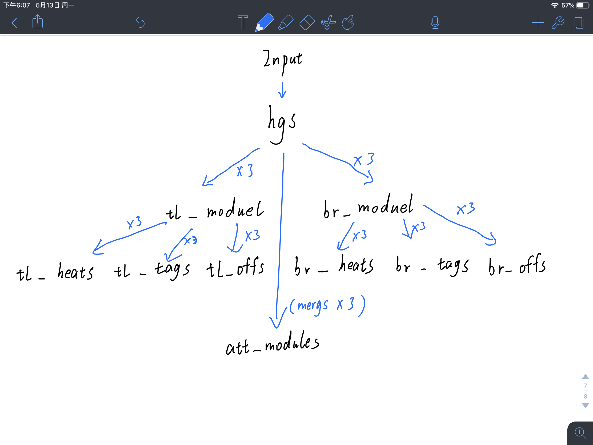

# CornerNet-Lite

论文原文：[CornerNet-Lite: Efficient Keypoint Based Object Detection](https://arxiv.org/abs/1904.08900)

## 前言

​		CornerNet-Lite 的前身是 CornerNet，而 Lite 代表轻巧便捷的意思。之所以会再产出一个 Lite，就是因为 CornerNet 的检测效率不够。虽然在 COCO 上的平均精度为 42.2%，但推理成本是 1.147 s/帧， 远远达不到实时检测的要求。

> 关于 CornerNet ，其精度比起其它而言是高，但似乎有个异类PANet，AP贼高。
>
> 实时检测，记忆中至少也要 30 FPS。

​		Lite 系列就是为了减轻模型的负重，让 CornerNet 尽可能在保持精度的情况下提升检测效率。作者提出了两个CornerNet 的变体：

 	1. `CornerNet-Saccade`。减少每张图处理的像素量。
 	2. `CornerNet-Squeeze`。减少每个像素的处理量。

## CornerNet-Saccade

​		该变体旨在 “减少每张图处理的像素量” ，意味着我们必须处理应该处理的部分，对于其它无关部分就不进行过多处理。人类视觉有一个非常有趣的现象，我们对眼睛聚焦点的事物感知非常好，而非聚焦点外的事物感知比较弱（应该在图像处理课上说过）。鉴于这一点，CornerNet-Saccade 就提出了注意力图（Attention Map），用来描述整张图值得关注的区域。下图是 CornerNet-Saccade 的网络结构图。

=======

### Downsizing

​		这一步是为了降低图像分辨率，文中提到会降低到两个尺寸，一个是 255x255，一个是 192x192。且 192x192 的图像会用 “0” 填充至 255x255，这样两个尺寸的图像就可以并行操作。

> 做目标检测的时候，分辨率的高低决定了携带信息量。分辨率越高，能携带的信息就越多，对于检测而言就更有益; 相对的，会越占内存，越吃计算量，越耗时间。作者的目的是要减轻 CornerNet 负重，降低分辨率是一个好选择。虽然会损失一部分信息，但作者认为上下文信息可以弥补，所以选择将所有原始图像缩放到 255 x 255、192 x 192 两个尺寸。192 进行“0”填充扩充到255的目的是为了并行操作，应该是不用对两种尺寸进行操作协调。然后将缩放后的图作为输入来预测注意力图。感觉分辨率选大还是选小是矛盾，作者前文说降低分辨率会加快速度，对精度有一定影响，但后面又说在网络没有想的那么脆弱，可以用上下文信息预测。

### Generating Object Location

​		该网络主要是用于预测注意力图，但同时会有概率预测出边界框。实际网络结构如下图所示。

> 完整介绍在 [CornerNet_Saccade 网络描述](https://github.com/hdusnewball/Footprint/blob/master/Deep_Learning/Detection/CornerNet/CornerNet_Saccade网络描述.md)

=======
​		网络一开始使用作者改进后的堆叠沙漏网络（stacked hourglass network），获取到三个尺寸的特征图用来分别预测三个尺寸的注意力图。同时还会将这三个尺寸拿去预测**左上角热点图**和**右下角热点图**（也就是 `tl_heats` 和 `br_heats` ），然后根据各自的 tags（CornerNet 中的 embeddings）来判断左上角和右下角是否匹配，匹配成功且达到最低阈值的一对Corner（左上角、右下角）将根据自己的 offset 调整位置并产生边界框 。

> 注意力图包含的信息应该是按位（像素）存储 得分 和 物体尺寸信息，这样足以描述一个物体及其应有的边界框，具体如何描述没有提及。在这之后的网络应该只需要处理得分高于阈值的位置。
>
> 注意力图最终会产生 3 个，作者是希望用不同尺度的特征图去针对性的检测不同尺寸的目标物。精细的注意力图去预测小目标，而粗略的注意力图预测大目标物。

### Cropping regions

​		前面得到的位置点（注意力图的高分点和边界框中心位置）会进行排序并选择较高的K个进行处理。而处理区域不会是整张图，而是到原图像去进行裁剪得到高分辨率的图像，然后再送到后面的检测网络继续检测。

> 这里的裁剪没有理解作者到底想怎么裁剪。作者提出，对于大中小三个尺寸的物体而言，希望对小物体放大倍数更多，大物体不放大（ss=4, sm=2, sl=1，这是小、中、大物体的放大倍数）。然后论文中提到：
>
> “At each possible location (x, y), we enlarge the **downsized image** by si ，where i={s, m, l} depending on the caorse object scale. Then we apply CornerNet-Saccade to a 255x255 window centered at the location.”
>
> 令我奇怪的地方我标出来了，他之前说需要分辨率高的图像，网络结构也从输入图像那儿分出支路了，但在这个地方却说将“缩小后的图像”做放大处理，然后以位置点为中心，取255x255的区域裁剪下来做后续预测。

### Detecting Objects

​		这个地方没有更详细的介绍了，我认为应该是以下两步：

1. **回归：**

​		这一步实际上不生成框，只做框回归。因为前面已经根据位置点探测出了边界框，在这个网络应该只是对边界框做一下回归就好，找出更加准确的框位置。

2. **Soft-NMS：**

​	NMS是非最大抑制，目的是去掉冗余框。它去掉冗余框的方式是将框的分数置0。这样其实会导致很多高IoU的多个物体最终只有一个框。Soft-NMS采取的策略是降低分数而不是置0，也就是给其它框一些回旋的余地。

### Merging Detections

​		这一步就是把上一步得到的框的位置映射回原本的输入图像中。

## CornerNet-Squeuze

​		他与 Saccade 的处理方式不同，网络没有做较大改动，而是借鉴的 SqueuezeNet 和 MobileNet 的方法直接减轻网络。

> 作者对这一部分描述更少，因为实际做的工作不如Saccade多，这一部分就是借鉴别人的思想来给自己的网络减负。
>
> 目前应该不会继续看下去，待完善。

