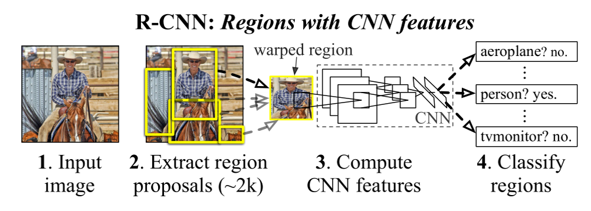

### 预测过程

### 一、Extract region proposals
#### Graph-Based Image Segmentation 预分割
```
Step1：每个像素点与其4领域或8领域连成边并计算不相似度(不相似度计算为r,g,b值的欧式距离)
Step2：按边的不相似度从小到大排序得e1 e2 …… eN
Step3：选择en (n=1,2,3,…N)
Step4：对当前选择边进行合并判断，设其连接的顶点为（vi , vj)
                若vi , vj 属于不同区域且它们之间的最大不相似度不大于它们内部的最大不相似度
                即wij<=Mint(Ci , Cj),则执行step5；否则若n<N，n=n+1，执行step3；
Step5：合并Ci，Cj区域，更新阈值及类标号，更新合并后的区域不相似度的与之为wij+k/|Ci, Cj| ,后半段
                 是初始阈值。                 

```
#### Selective Search 生成候选框
```
Step1：预分割的结果为R={r1，r2，r3……rn};初始化相似集合S=Ø
Step2：计算两两的相似度并添加到集合S中S={s(ri, rj) , i<j}
Step3：while S!=Ø :
                   先得到S中的最大值s(rm, rn) =max(S)
                   从集合S中移除所有与m，n 有关的相似度S=S- S(ri, r*)-S(r*, rj)
                   合并rm， rn区域为rt，加入到集合R中，R=RU rt
                   计算rt与其他区域两两组合的相似度加入S
              L=R中所有区域对应的边框为生成的候选框

```
此处的相似度计算涉及颜色相似度、纹理相似度、优先合并小的区域、区域的合适度距离，四个要素按不同权重累加。
### 二、CNN
#### 监督学习预训练AlexNet
使用ImageNet数据集预训练AlexNet
#### 迁移AlexNet，微调（Fine-tune）
使用特定领域的检测数据集PASCAL VOC微调迁移的网络，把网络结构最后一层改为21个分类输出（20个为物体类别，1个为背景类别）。
训练CNN时，输入的候选框与接近位置的GT的IOU>0.5=的为正样本，监督的分类标签为相应类；否则为负样本，类别为背景。
### 三、SVM
#### 监督学习训练每个类的SVM
把网络的最后一层改为二分类SVM，使用正样本为IOU=1的候选框（即为GT）；负样本为IOU<0.3的候选框（0.3由训练的最好效果得到），剩余的样本舍弃。训练21个SVM。
#### Hard Negative mining
因为正样本的数量远远小于负样本，正样本的分类准确率较低，会出现很多false positive（把负样本分到了正样本里）。把这部分样本再拿到模型中训练，会大大优化结果。
#### NMS处理
非极大值抑制法，只保留某个GT框对应的SVM打分最高的一个候选框作为这部分的预测结果。
### 四、回归
对上面SVM筛选出来的预测框做线性回归训练（训练候选框P=(px, py, pw , ph)到真值G=(Gx, Gy, Gw, Gh)的映射。
线性映射分解成4个部分，x，y方向上的平移和w，h的尺度变化。